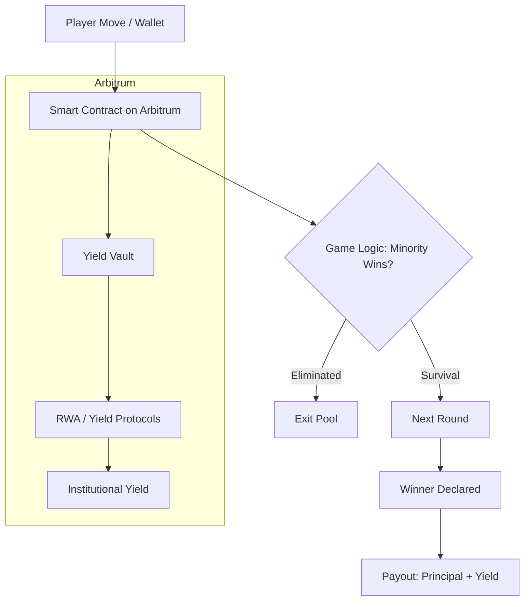

#  INVERSE ARENA

## The RWA-Powered multiplayer blockchain elimination game where the minority wins. Built on Arbitrum.

[](https://arbitrum.io)
[](https://docs.arbitrum.io)

**Inverse Arena** is a high-stakes "Last Man Standing" prediction game where players compete by making binary choices (Heads or Tails). The twist: players who choose the **minority option** advance, while the majority are eliminated.

While players battle psychologically, their entry fees are never idle. Built on **Arbitrum**, Inverse Arena automatically routes prize pools into **Real-World Asset (RWA)** protocols to generate institutional-grade yield during gameplay.

---

## 🎯 The Problem

### 1. The GameFi Sustainability Crisis

Most Web3 games rely on inflationary token emissions to reward players. When new player growth slows, the token value crashes, the economy collapses, and the project fails. Investors are tired of "Ponzinomics" that lack a real revenue floor.

### 2. The Idle Capital Inefficiency

Currently, billions in GameFi TVL (Total Value Locked) sits stagnant in smart contracts. While players and stakers wait for matches or progress through levels, their capital earns **$0** interest. This is a massive opportunity cost for users and a waste of liquidity for the ecosystem.

### 3. The "Majority-Rule" Boredom

Traditional prediction games often reward the majority, leading to "herd behavior" and low-stakes excitement. There is a lack of high-tension, contrarian gameplay that rewards strategic intuition and psychological play, leading to stagnant retention rates.

### 4. Fragmented UX & Value Friction

Players face a "dead-air" problem: long matchmaking wait times with no value accrual. If a player waits 10 minutes for a game to start, they have lost both time and potential yield. Current platforms fail to bridge the gap between DeFi earning and Active gaming.

---

## 💡 Solution

1. **RWA-Powered Prize Pools**: Player stakes (e.g. USDC) are never idle. They are immediately routed into institutional-grade, yield-bearing Real-World Assets. The prize pool grows every second the game is active.

2. **The "Contrarian" Game Engine**: A high-tension PvP survival game where you only survive if you choose the minority side. It's a psychological battle that rewards strategy over herd behavior.

3. **Arbitrum Speed & Cost**: Leveraging Arbitrum's low fees and high throughput to ensure instant matchmaking and seamless, low-cost "Heads or Tails" rounds.

4. **Sustainable Rewards**: Unlike other games, our rewards aren't "printed"—they are harvested from real-world yield, creating a non-inflationary, long-term economic model.

---

## ⚡ Why Arbitrum?

Arbitrum is the chosen layer for Inverse Arena because of:

- **Fast Finality**: Quick settlement—essential for fast-paced elimination rounds.
- **Low Fees**: Cost-effective transactions, enabling micro-stake games and frequent rounds.
- **EVM Compatibility**: Familiar tooling, wallets (MetaMask, etc.), and smart contracts (Solidity).
- **RWA & DeFi Ecosystem**: Access to yield-bearing assets and protocols for prize pool yield.

---

## 💎 Real-World Asset Integration

Traditional GameFi prize pools are stagnant. Inverse Arena turns capital into a productive asset:

- **Yield-Bearing Assets**: Entry fees (e.g. USDC) are deployed into institutional-grade RWA protocols for real yield.
- **Sustainable Rewards**: Winnings are paid out as **Principal + Accumulated Yield**, creating a non-inflationary economic model.

---

## 🕹️ Game Mechanics

### 1. The "Contrarian" Engine

Players enter a pool. Each round, they must predict what the *fewer* number of people will choose.

- **Majority Chose Heads?** → Heads are eliminated.
- **Minority Chose Tails?** → Tails advance to the next round.
- **One Survivor?** → The "Last Man Standing" claims the entire pool + RWA yield.

### 2. Pool Lifecycle

- **Creation**: Hosts stake to create a pool (native or stablecoin).
- **Entry**: Players join using USDC or supported assets.
- **Yield Start**: Smart contracts move funds to yield-bearing RWA vaults.
- **Resolution**: Rounds execute every 30–60 seconds until a winner is declared.

---

## 🏗️ Architecture



### Smart Contract Components (EVM / Arbitrum)

- **Arena Manager**: Manages player states, round timing, and elimination logic.
- **RWA Adapter**: Interfaces with yield protocols to deploy and accrue yield on prize pools.
- **Randomness**: Fair round outcomes (e.g. commit–reveal or VRF).

---

## 🗺️ Roadmap

### Phase 1: Arbitrum Testnet ✅

- Core game logic deployment on Arbitrum (e.g. Sepolia or Arbitrum Sepolia).
- Alpha testing with early players.

### Phase 2: Mainnet & RWA ⏳

- Mainnet launch on Arbitrum One.
- Integration with yield-bearing RWA protocols for prize pool yield.

### Phase 3: Expansion 🚀

- Mobile-friendly experience and wallet support.
- DAO-governed RWA allocation strategies.
- Private "Arena" hosting for influencers and brands.

---

## 🛠️ Development

### Prerequisites

- Node.js 18+
- npm or yarn

### Setup

```bash
npm install
npm run dev
```

### Scripts

| Command        | Description              |
|----------------|--------------------------|
| `npm run dev`  | Start dev server         |
| `npm run build`| Production build         |
| `npm run start`| Start production server  |
| `npm run lint` | Run ESLint               |

Open [http://localhost:3000](http://localhost:3000) to view the app.

---

## 📄 License

See repository license file.
